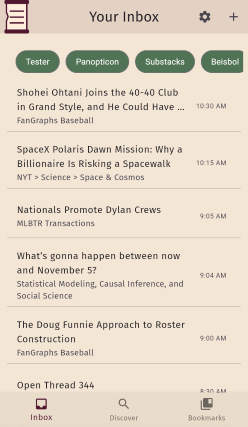
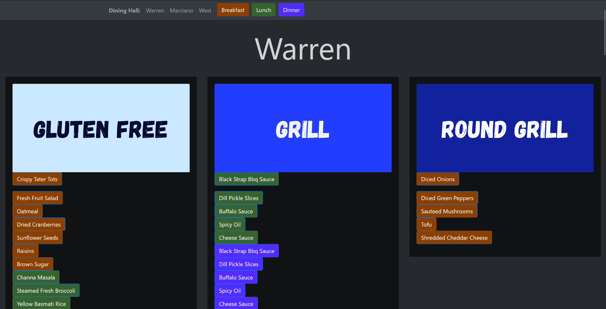
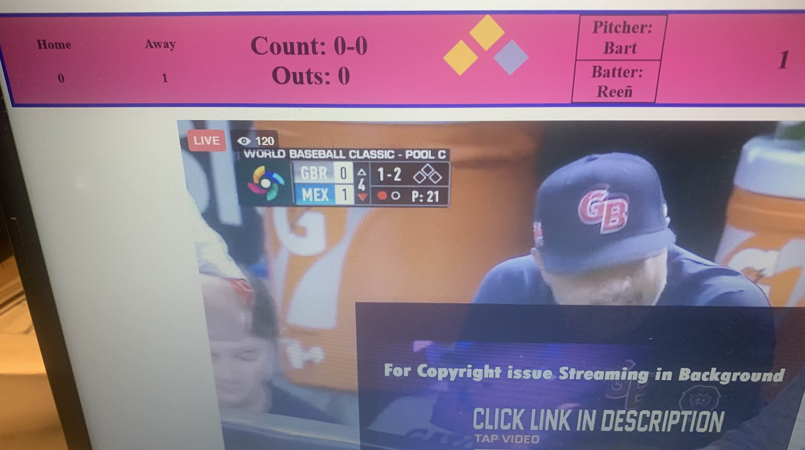

# Sam Cowan Landing Page
## Hi, I'm Sam Cowan

**I'm a rising second-year at Boston University studying Data Science and Statistics. Some of my interests include sports analytics, elections, forecasting ([see Tetlock](https://en.wikipedia.org/wiki/Superforecasting:_The_Art_and_Science_of_Prediction)), and reading old blogs**

**I'm currently looking for 2025 internships in:**
- Software Engineering
- Data Science
- Data Analysis
- ... and other similar fields

### Links
- [Linkedin](https://www.linkedin.com/in/sam-t-cowan/)
- [Github](https://github.com/samc5)
- [Resume](resume.pdf)

## Independent Projects

[Papyrss](https://expertify.samcowan.net)  

  A modern RSS Reader built with a **Flask** backend, a **Flutter** frontend, and a **GraphQL** API. Papyrss uses a **MongoDB** cloud database and is hosted on an **Azure** virtual machine. Users can subscribe to RSS feeds and categorize them to their needs, as well as bookmark articles, and add feeds to the crowdsourced database. I've been building this app since January and intend to continue expanding it for an eventual mobile release.

[Better BU Dining](https://budining.samcowan.net)  

A tool I made at the beginning of freshman year with **Flask** and **Bootstrap** to help myself and others with dietary restrictions navigate the BU dining halls. The actual BU Dining website offers filters but these don't work as intended, particularly for gluten free food. Better BU Dining scrapes the dining hall website with **BeautifulSoup** and stores the menu every day in a **Firebase** database. Users can select dietary restrictions which the app looks for in the ingredients lists of the menu items. 

[WatchPeglegs](https://github.com/samc5/WatchPeglegs) (no longer hosted)    
A **Flask** app I built for the 2023 Stuyvesant baseball season to display a scoreboard above the embedded facebook livestream of our games. I used **Selenium** to scrape the url of GameChanger's private API which was used to update the scoreboard live. Below is a low-quality photo from the testing process (the only one I have of the now-obsolete site in use)

## Class Projects

- [Rate My Professors Ratings Prediction](https://github.com/samc5/RMP_110) ([DS 110](https://www.bu.edu/academics/cds/courses/cds-ds-110/))

For my DS 110 final project, I used various **Python** libraries (**pandas**, **scikit-learn**, **nltk**) to analyze a dataset of 20,000 RateMyProfessors reviews for characteristics that most impacted professor ratings. I trained random forest classifier and linear regression models to predict each professor’s average rating. I also experimented with Word2Vec embeddings to compute attractiveness ratings for professors based on students' descriptions of them, and conducted t-tests to determine statistical significance of correlations (yes, more attractive professors had higher ratings)

- [Social Connection Graph Analysis](https://github.com/samc5/Final_DS210) ([DS 210](https://www.bu.edu/academics/cds/courses/cds-ds-210/))

For my DS 210 project in **Rust**, I analyzed a graph dataset of Facebook social connectedness between US counties and worldwide countries. I cleaned and re-formatted the data, and constructed a minimum spanning tree to keep only the most significant connections between locations. I then analyzed the results to verify unexpected edges (i.e. Singapore to Elmore County, Idaho, which turns out to be the site of a Singaporean air force base).

- [College Informer](https://github.com/samc5/CollegeInformer) (Stuy SoftDev)

As part of a group in Software Development, I built a **Flask** app giving users a dashboard of information about logistics and residential life at a selected college. We utilized the College Scorecard and Bing Maps APIs to calculate driving time and transit directions from NYC. We pointed out 5 locations of interest, annual weather patterns, gas prices, and embedded maps with the Bing Maps, Open Meteo Weather, and GasBuddy APIs

### Work Experience

**Transporation Engineering Intern @ Philip Habib and Associates** (May - August 2024)
- Compiled a database of 5000+ data points sourced from previous projects to assist with automating trip generation analysis
- Conducted field visits around NYC to perform counts, measurements, and other observations  to assist with traffic forecasts
- Wrote Excel macros in **VBA** to increase productivity of data entry tasks, with instructions for users without coding experience
- Modeled traffic noise by learning 2004 software and presented a 30-minute tutorial to the planning department
- Drew maps in AutoCAD and by hand for use in field observations

**Research Assistant @ BU** (March 2024 - Present)

- Working with BU and Harvard researchers specializing in terrorism and radicalization
- Coding dataset for demographics and other factors with goal of analyzing underlying causes of violent extremism
- Writing summaries of extremist ideologies

**Open Streets Intern @ Prospect Heights Neighborhood Development Council** (July - August 2023)

- Collected data on pedestrian and micro mobility usage at Vanderbilt and Underhill Open Streets in Brooklyn, and collaboratively researched, wrote, and conducted a post-event satisfaction survey for public programming
- Analyzed user counts and survey data with **R** and **Excel** to compile a report with data visualizations, comparisons to previous years, and recommended strategies for future data collection

